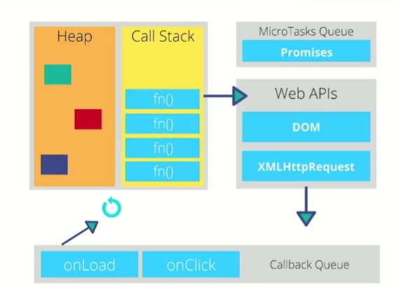
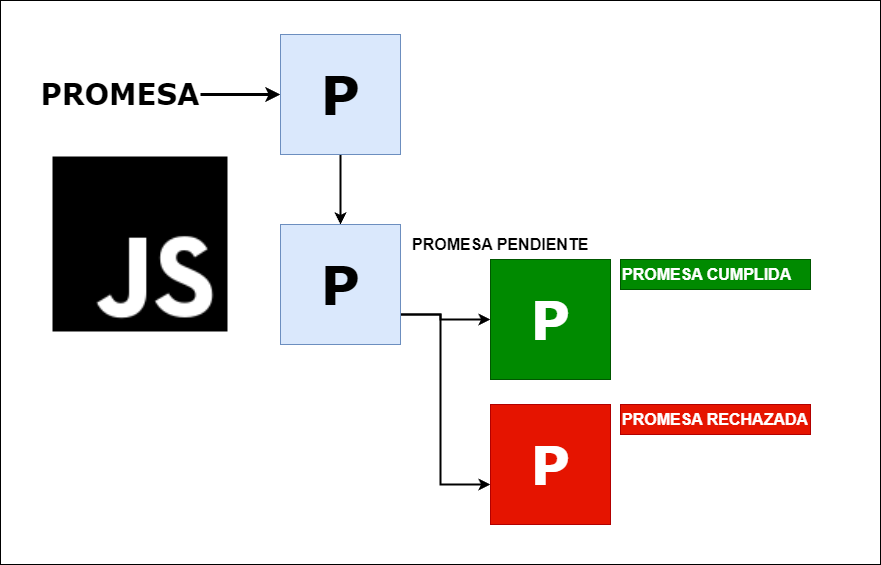

# Asincronismo con JavaScript

El asincronismo indica que las tareas se pueden realizar mas tarde, no necesariamente en el orden en que se escriben. En JavaScript, las tareas asincrónicas se realizan mediante el uso de callbacks, promesas y async/await.
Primero hay ciertas particularidades a tener en cuenta antes de empezar a trabajar con el asincronismo en JavaScript:
- Single Thread: JavaScript es un lenguaje de programación de un solo hilo, lo que significa que solo puede realizar una tarea a la vez.
- Call Stack: Es una estructura de datos que se encarga de almacenar las tareas que se están ejecutando en ese momento.
- Sincronico: Las tareas se realizan en el orden en que se escriben.
- Asincronico: Las tareas se realizan en un orden distinto al que se escriben, es decir las tareas se ejecutan en segundo plano.
- Event Loop: JavaScript maneja la concurrencia mediante un bucle de eventos (Event Loop), que se encarga de manejar las tareas asincrónicas. El Evento loop controla el flujo de ejecución de las tareas en JavaScript, las partes más importantes del Event Loop son:
    - Call Stack: Se encarga de almacenar las tareas que se están ejecutando en ese momento.
    - Callback Queue: Se encarga de almacenar las tareas asincrónicas que se han completado.
    - Microtask Queue: Se encarga de almacenar las tareas asincrónicas de alta prioridad.
    - Task Queue: Se encarga de almacenar las tareas asincrónicas de baja prioridad.
    - Event Loop: Se encarga de manejar las tareas asincrónicas y de decidir cuándo se ejecutan.
    - Web APIs: Son las APIs que proporcionan los navegadores para realizar tareas asincrónicas, como hacer peticiones HTTP, manejar eventos, etc.




- [Event Loop Simulador](http://latentflip.com/loupe/?code=JC5vbignYnV0dG9uJywgJ2NsaWNrJywgZnVuY3Rpb24gb25DbGljaygpIHsKICAgIHNldFRpbWVvdXQoZnVuY3Rpb24gdGltZXIoKSB7CiAgICAgICAgY29uc29sZS5sb2coJ1lvdSBjbGlja2VkIHRoZSBidXR0b24hJyk7ICAgIAogICAgfSwgMjAwMCk7Cn0pOwoKY29uc29sZS5sb2coIkhpISIpOwoKc2V0VGltZW91dChmdW5jdGlvbiB0aW1lb3V0KCkgewogICAgY29uc29sZS5sb2coIkNsaWNrIHRoZSBidXR0b24hIik7Cn0sIDUwMDApOwoKY29uc29sZS5sb2coIldlbGNvbWUgdG8gbG91cGUuIik7!!!PGJ1dHRvbj5DbGljayBtZSE8L2J1dHRvbj4%3D)

Teniendo en cuenta estas definiciones podemos empezar a trabajar con el asincronismo en JavaScript. Hablemos de como maneja JavaScript las tareas asincrónicas.

## Callbacks
Los callbacks son funciones que se pasan como argumentos a otras funciones y se ejecutan después de que una tarea asincrónica se haya completado. Los callbacks son la forma más antigua de trabajar con el asincronismo en JavaScript.

- Los callbacks como funciones de orden superior: Esto indica que las fucniones son tratados como ciudadanos de primera clase, es decir estas fucniones pueden ser asignadas a variables, pasadas como argumentos y retornadas como valores.
- Anidamiento de callbacks: Es una mala práctica, ya que se puede caer en el callback hell, que es un código difícil de leer y mantener.


La forma triangular que produce es conocida como Callback Hell o Pyramid of Doom, debido a su forma, resultando un código muy poco elegante que se puede complicar demasiado de cara a la legibilidad. Es cuando entran en juego las promesas, que veremos en el siguiente capítulo.

```javascript
function callback() {
    console.log('Hola Mundo');
}

setTimeout(callback, 1000);
```

## Promesas

Las promesas son objetos que representan la terminación o el fracaso de una tarea asincrónica. Las promesas tienen tres estados:
Como su nombre lo indica una promesa es algo que en un pricnipio pensamos que ocurrira pero en el futuro pueden pasar muchas cosas, puede cumplirse o no cumplirse.



Las promesas tienen tres estados:
- Pending (Promesa Pendiente): Estado inicial, la promesa no se ha cumplido ni rechazado.
- resolve (Promesa Cumplida): La promesa se ha cumplido.
- Rejected (Promesa Rechazada): La promesa no se ha cumplido.

```javascript
const promesa = new Promise((resolve, reject) => {
    setTimeout(() => {
        resolve('Promesa resuelta');
    }, 1000);
});

promesa.then((response) => {
    console.log(response);
});
```

cada promesa tiene las siguientes funciones:

- then: Se ejecuta cuando la promesa se ha cumplido.
- catch: Se ejecuta cuando la promesa no se ha cumplido.
- finally: Se ejecuta siempre, tanto si la promesa se ha cumplido como si no.

```javascript
const promesa = new Promise((resolve, reject) => {
    setTimeout(() => {
        reject('Promesa rechazada');
    }, 1000);
});

promesa.then((response) => {
    console.log(response);
}).catch((error) => {
    console.log(error);
}).finally(() => {
    console.log('Promesa finalizada');
});
```

## Async/Await

Async/Await es una forma de trabajar con promesas de una manera más sencilla y legible. Async `asíncrono` es una palabra clave que se utiliza para declarar una función asincrónica, mientras que Await `esperar` es una palabra clave que se utiliza para esperar a que una promesa se resuelva. Es lo que utilizaremos en la mayoría de los casos para trabajar con el asincronismo en JavaScript.

```javascript

// uso de promesas
fetch('https://jsonplaceholder.typicode.com/todos/1')
    .then(response => response.json())
    .then(data => console.log(data));

// uso de async/await
async function miFuncion() {
    const reponse = await fetch('https://jsonplaceholder.typicode.com/todos/1');
    const data = await response.json();
    console.log(data);
}

miFuncion();
```
- Async: Se utiliza para declarar una función asincrónica.
- Await: Se utiliza para esperar a que una promesa se resuelva.
- Fetch: Es una función que se utiliza para hacer peticiones HTTP.
- JSON: Es un formato de intercambio de datos.

## Resumen
- cons async y await seguimos manejanod promesas pero de una forma mas sencilla y legible.
- await solo se puede utilizar dentro de una función asincrónica.
- await pausa la ejecución de la función hasta que la promesa se resuelva.
- No encadenamos promesas con then, sino que utilizamos async y await.

## Ejercicios

1. Crear una función que reciba un número y retorne una promesa que determine si el número es par o impar. La promesa debe cumplirse si el número es par y rechazarse si el número es impar.
2. Crear una función asíncrona que reciba un número como parámetro y retorne el mensaje "El número es par" si el número es par o "El número es impar" si el número es impar.
3. Crear una función asíncrona que reciba un array de números como parámetro y retorne la suma de todos los números. La función debe rechazar la promesa si alguno de los elementos no es un número.
4. Crear una función asíncrona que reciba un array de números como parámetro y retorne la suma de todos los números. La función debe rechazar la promesa si alguno de los elementos no es un número.
5. Crear una función asíncrona que reciba un array de números como parámetro y retorne un array con los números elevados al cuadrado. La función debe rechazar la promesa si alguno de los elementos no es un número.

## Siguientes pasos

Ahora que sabemos como funcuiona el asincronismo en JavaScript, podemos empezar a trabajar con APIs, bases de datos, etc. Para ello necesitamos conocer cómo hacer peticiones HTTP, cómo trabajar con bases de datos, etc. En los siguientes capítulos veremos cómo trabajar con APIs, bases de datos, etc.

- DOM: Document Object Model
- Eventos
- Petición HTTP con Fetch
- Modulos

En el siguiente capítulo veremos cómo trabajar con el DOM en JavaScript.
para dirigete al siguiente capítulo [DOM](./DOM.md)