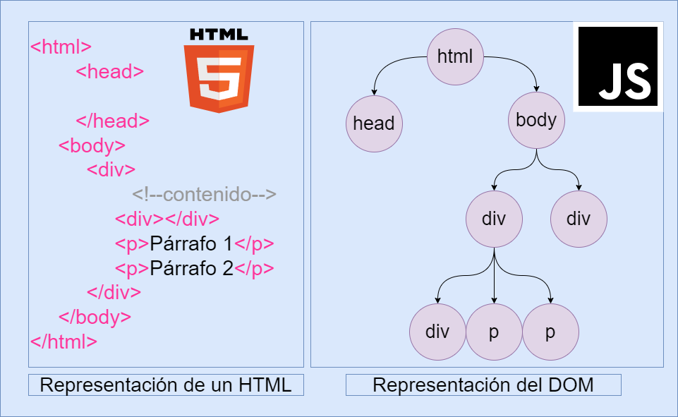
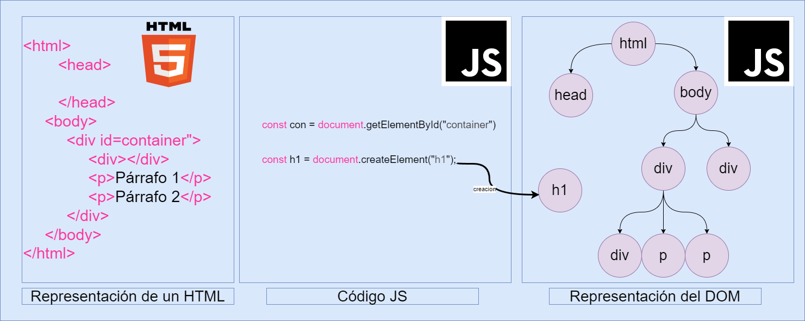
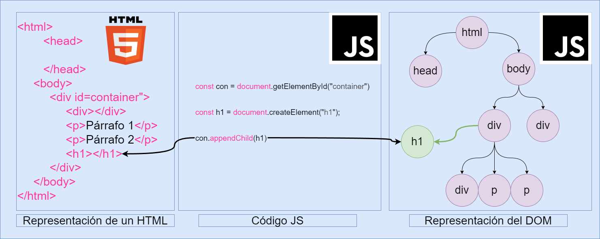

# DOM (Document Object Model)

## Qué es el DOM?

- Hasta este punto hemos ido trabajando unicamente con HTML y CSS que estas son las tecnologias que se encargan de la estructura y el diseño de la pagina web, permitiendonos crear unicamente oaginas web staticas. Pero de que nos sirve solo crear paginas web estaticas si no podemos interactuar con ellas?, y es aqui donde surge js que nos permite crear paginas qeb dinamicas para crear paginas cin mucha mas funcionalidad y que se puedan interactuar con el usuario. Todo esto gracias a que con js podemos manipular el DOM.
- El DOM por sus siglas en ingles `Document Object Model`, es una interfaz de programación de aplicaciones (API) para documentos HTML y XML. Proporciona un conjunto de objetos para acceder, eliminar, modificar el contenido de y la estructura de un documento web.
  
  - Un documento `html`esta formado por multiples etiquetas anidadas una dentro de otra, crerando una estructura de arbol. y el DOM es esto mismo, una representacion de este arbol en forma de objetos que podemos manipular con js.



### El objeto `document`:

- El objeto `document` es el objeto principal del DOM, y representa el documento HTML. dentro de ella encontramos todos los elementos que conforman el documento, como los elementos `html`, `head`, `body`, etc. Pero estas se engoban con `Element`, `Node`.
  - `Element`: Representa una etiqueta de manera generica como `div`, `p`, `h1`, etc, tomando el tipo de HTMLElement.
  - `Node`: Representa cualquier tipo de nodo, ya sea un elemento, texto, comentario, etc.
  Estas se clasifican dependiendo del tipo de elemento que sean
<!--table-->
| Tipo de dato Generico   | Tipo especifico        | Etiqueta                             |
|-------------------------|------------------------|--------------------------------------|
| `Element` `HTMLElement` | `HTMLDivElement`       | `<div>`                              |
| `Element` `HTMLElement` | `HTMLParagraphElement` | `<p>`                                |
| `Element` `HTMLElement` | `HTMLHeadingElement`   | `<h1>, <h2>, <h3>, <h4>, <h5>, <h6>` |
| `Element` `HTMLElement` | `HTMLImageElement`     | ``                              |
| `Element` `HTMLElement` | `HTMLInputElement`     | `<input>`                            |


## Crear, eliminar, modificar elementos

- Para poder manipular el DOM, primero debemos seleccionar los elementos que queremos manipular, y para esto tenemos varias formas de hacerlo, como por ejemplo:
  - `document.getElementById()`: Nos permite seleccionar un elemento por su `id`.
  - `document.getElementsByClassName()`: Nos permite seleccionar un elemento por su `clase`.
  - `document.getElementsByTagName()`: Nos permite seleccionar un elemento por su `etiqueta`.
  - `document.querySelector()`: Nos permite seleccionar un elemento por un `selector css`.
  - `document.querySelectorAll()`: Nos permite seleccionar todos los elementos que cumplan con un `selector css`.

### Crear elementos

- Para poder crear un elemento, primero debemos crearlo con el metodo `document.createElement()`, y luego podemos añadirlo al documento con el metodo `appendChild()`.

```js
// Crear un elemento
const div = document.createElement('div');

// Añadir un texto al elemento
div.textContent = 'Hola mundo';

// Añadir el elemento al documento
document.body.appendChild(div);
```

- Existen aun mas metodos que nos permiten crear elementos, como por ejemplo:
  - `document.createTextNode()`: Nos permite crear un nodo de texto.
  - `document.createComment()`: Nos permite crear un nodo de comentario.
  - `document.createDocumentFragment()`: Nos permite crear un fragmento de documento.
  - `document.createAttribute()`: Nos permite crear un atributo.
  - `document.createEvent()`: Nos permite crear un evento.
cada uno de estos metodos lleva un parametro que es el valor que se le asignara al elemento.




- nota que en la imagen se muestra que el metodo `document.createElement()`, este solo nos permite crear el elemento pero no lo agrega al documento, para esto debemos usar el metodo `appendChild()`.



### Eliminar elementos

- Para poder eliminar un elemento, primero debemos seleccionarlo y luego podemos eliminarlo con el metodo `remove()`.

```js
// Seleccionar un elemento
const div = document.getElementById('my_modal_7');

// Eliminar el elemento
div.remove();
```

### Modificar elementos

- Para poder modificar un elemento, primero debemos seleccionarlo y luego podemos modificarlo con sus propiedades.

```js
// Seleccionar un elemento
const div = document.getElementById('myDiv');

// Modificar el contenido del elemento
div.textContent = 'Hola mundo';
```

- en cada elemento del DOM tenemos propiedades que podemos modificar, como por ejemplo:
  - `textContent`: Nos permite modificar el contenido de texto de un elemento.
  - `innerHTML`: Nos permite modificar el contenido de html de un elemento.
  - `style`: Nos permite modificar el estilo de un elemento.
  - `classList`: Nos permite modificar las clases de un elemento.


## Manejo de atributos

Para entender como manipular los atributos de un elemento, primero debemos entender que son los atributos de un elemento. Entonces bayamos a definir que es un atributo.

### Qué es un atributo?

Priemeramenete hablemos de elementos `html`, seguramente as visto que en cada elemento `html` lo siguiente:
```html
<div class="container" id="myDiv" style="color: red;"></div>
```
- En este caso `class`, `id`, `style` pero que es esto, estos son los atributos de un elemento `html`, y estos son los que nos permiten darle caracteristicas a un elemento, como por ejemplo:
  - `class`: Nos permite asignarle una clase a un elemento.
  - `id`: Nos permite asignarle un identificador a un elemento.
  - `style`: Nos permite asignarle estilos a un elemento.
- Entonces los atributos son pares de clave-valor que se encuentran dentro de las etiquetas de un elemento `html`, y estos nos permiten darle caracteristicas o definir su comportamiento de la estiqueta a la que pertenecen.
- Existen atributos generales que tienen todos los elementos `html` y tambien existen atributos especificos que tienen ciertos elementos `html`.

Ahora que ya sabemos que es un atributo, vamos a ver como podemos manipular estos atributos con js.

### Acceder a atributos

- Para poder acceder a los atributos de un elemento, primero debemos seleccionarlo y luego podemos acceder a sus atributos del elemento seleccionado. para ello tomemos como ejemplo el siguiente codigo: HTML
```html
<div id="myDiv"></div>
```

```js
// Seleccionar un elemento

const div = document.getElementById('myDiv'); // <div id="myDiv"></div>

// Acceder a los atributos del elemento
element.id = "page";           // <div id="page" class="container"></div>
element.style = "color: red";  // <div id="page" class="container" style="color: red"></div>
element.className = "data";    // <div id="page" class="data" style="color: red"></div>
```

- Con el codigo anterior podemos ver como podemos acceder a los atributos de un elemento, y como podemos modificarlos. En este caso estamos accediendo a los atributos `id`, `style`, `class`.


  - Algo nuevo que talves as notado es al momento de acceder `element.className`, pero no se supone que el atributo es `class`, entonces que es lo que esta pasando aqui, pues resulta que `class` es una palabra reservada en js, por lo que no podemos usarla como nombre de una variable, por lo que en su lugar usamos `className`.
  

  - Oh pero que interesante verdad, pero entonces donde uso `class` porque es una palabra reservada, pues resulta que en js tambien acepta la programacon orientada a objetos, pero en js se le denomina `prototipos`, y en este caso `class` es una palabra reservada para la creacion de prototipos, por lo que no podemos usarla como nombre de una variable. Ejemplo
    ```js
    class Persona {
      constructor(nombre, edad) {
        this.nombre = nombre;
        this.edad = edad;
      }
    }
    ```
    
    - No te preocupes si no lo entiendes, ya llegara el momento de que hablemos de POO en javascript, por el momento solo dire que aqui no paso nada :).
    

  - Pero entonces como puedo acceder a los atributos que tienen guiones, como por ejemplo `data-`, pues resulta que en js no podemos usar guiones en los nombres de las variables, por lo que en su lugar usamos `dataset`. Ejemplo
    ```html
    <div data-name="John"></div>
    ```
    ```js
    const div = document.querySelector('div');
    console.log(div.dataset.name); // John
    ```

- Ahora hablemos de algunos metodos que nos permiten acceder a los atributos de un elemento, como por ejemplo:

| Metodo                | Valor de retorno | Descripcion                                                   |
|-----------------------|------------------|---------------------------------------------------------------|
| `getAttribute()`      | `String`         | Nos permite obtener el valor de un atributo de un elemento    |
| `setAttribute()`      | no retorna nada  | Nos permite establecer el valor de un atributo de un elemento |
| `hasAttribute()`      | `Boolean`        |  Nos permite saber si un elemento tiene un atributo           |
| `hastAttributes()`    | `Boolean`        | Nos permite saber si un elemento tiene atributos              |

- Ahora veamos un ejemplo de como podemos usar estos metodos:

```html

<div id="myDiv" class="container" style="color: red;"></div>
```

```js
// Seleccionar un elemento
const div = document.getElementById('myDiv');

// Obtener el valor de un atributo
console.log(div.getAttribute('id'));    // myDiv
console.log(div.getAttribute('class')); // container
console.log(div.getAttribute('style')); // color: red

// Establecer el valor de un atributo
div.setAttribute('id', 'page');
div.setAttribute('class', 'data');
div.setAttribute('style', 'color: blue');

// Saber si un elemento tiene un atributo
console.log(div.hasAttribute('id'));    // true
console.log(div.hasAttribute('class')); // true
console.log(div.hasAttribute('style')); // true
console.log(div.hasAttributes());       // true
```

### Modificar o Eliminar atributos

- Tambien tenemos funcione que no permten poder modificar o eliminar direcatmente estos atributos, como por ejemplo:

| Metodo                | Valor de retorno    | Descripcion                                                   |
|-----------------------|---------------------|---------------------------------------------------------------|
| `removeAttribute()`   | no retorna nada     | Nos permite eliminar un atributo de un elemento               |
| `toggleAttribute()`   | `Boolean`           | Nos permite agregar o eliminar un atributo de un elemento     |
| `replaceWith()`       | no retorna nada     | Nos permite reemplazar un atributo de un elemento             |
| `setAtriute()`        | no retorna nada     | Nos permite establecer el valor de un atributo de un elemento |

- Ahora veamos un ejemplo de como podemos usar estos metodos:

```html
<div id="myDiv" class="container" style="color: red;"></div>
```

```js
// Seleccionar un elemento
const div = document.getElementById('myDiv');

// Eliminar un atributo

div.removeAttribute('id');
div.removeAttribute('class');
div.removeAttribute('style');

// Agregar o eliminar un atributo
div.toggleAttribute('id');
div.toggleAttribute('class');
div.toggleAttribute('style');

// Reemplazar un atributo
div.replaceWith('id', 'page');
div.replaceWith('class', 'data');
div.replaceWith('style', 'color: blue');

// Establecer el valor de un atributo
div.setAttribute('id', 'page');
div.setAttribute('class', 'data');
div.setAttribute('style', 'color: blue');
```

### Atributos booleanos

- Existe un caso especial que son los atributos `booleanos`, estos son atributos que no necesitan un valor, como por ejemplo `disabled`, `checked`, `selected`, etc. En estos casos si el atributo esta presente, entonces su valor es `true`, de lo contrario su valor es `false`.
- Entonces como hago para modificarlos directamente con `js`, pues resulta que estos atributos son un poco especiales, ya que si el atributo esta presente, entonces su valor es `true`, de lo contrario su valor es `false`. Ejemplo
```html
<input type="checkbox" id="myCheckbox" checked>
<button id="myButton" disabled>Click me</button>
```
```js
const checkbox = document.getElementById('myCheckbox');
console.log(checkbox.checked); // true

// en el caso de un boton si esta habilitado o no
const button = document.getElementById('myButton');
console.log(button.disabled); // true

// hasta aqui todo bien pero como hago para modificar estos atributos, por lo que se vio en lo anterior podriamos pensar que modificar el valor de estos atributos seria de esta manera
button.setAttribute("disabled", true);   // ❌ <button disabled="true">Clickme!</button>
button.disabled = true;                  // ✅ <button disabled>Clickme!</button>
button.setAttribute("disabled", "");     // ✅ <button disabled>Clickme!</button>
```

pero esto es un poco confuso, ya que si el atributo esta presente, entonces su valor es `true`, de lo contrario su valor es `false`, por lo que si queremos modificar estos atributos, entonces debemos hacerlo de la siguiente manera:
```js
// utilizando el toggleAttribute es mas facil
button.toggleAttribute("disabled"); // ✅ Como ya existe "disabled", entonces lo eliminara
button.toggleAttribute("hidden"); // ✅ Como no existe "hidden", lo añade
```

### Ahora nos toca ver la API classList


