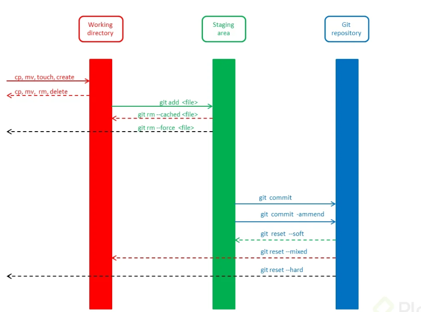

# Introducción a Git: Guía para Principiantes

---

## 1. Introducción a Git
### 1.1. ¿Qué es Git?
   git es un sistema de control de versiones distribuido, gratuito y de código abierto, diseñado para manejar todo tipo de proyectos, desde los más pequeños hasta los más grandes, con rapidez y eficiencia. Fue creado por Linus Torvalds en 2005, con el objetivo de gestionar el desarrollo del kernel de Linux, y desde entonces se ha convertido en una de las herramientas más populares y ampliamente utilizadas por desarrolladores de software en todo el mundo.
### 1.2. ¿Por qué usar Git?
- **control de versiones**: Git permite a los desarrolladores registrar y rastrear todos los cambios realizados en los archivos de un proyecto, lo que facilita la colaboración y la gestión de las diferentes versiones del software.
- **trabajo en equipo**: Git facilita la colaboración entre desarrolladores al permitir la sincronización de cambios entre repositorios locales y remotos alojados en servicios como GitHub, GitLab o Bitbucket.
- **flexibilidad y escalabilidad**: Git es capaz de manejar proyectos de cualquier tamaño y complejidad, desde pequeños scripts hasta grandes aplicaciones empresariales, con rapidez y eficiencia.
- **seguimiento de cambios**: Git permite a los desarrolladores ver y revertir cambios anteriores si es necesario, lo que facilita la identificación y corrección de errores en el código.
### 1.3. Principales características de Git

1. **Control de versiones**: Git registra cada modificación realizada en los archivos del proyecto, lo que permite a los desarrolladores ver y revertir cambios anteriores si es necesario.

2. **Ramas (branches)**: Git permite a los desarrolladores trabajar en diferentes versiones del proyecto de manera simultánea, lo que facilita el desarrollo de nuevas características sin afectar la rama principal (normalmente llamada `master` o `main`).

3. **Repositorios remotos**: Git facilita la colaboración entre desarrolladores al permitir la sincronización de cambios entre repositorios locales y remotos alojados en servicios como GitHub, GitLab o Bitbucket.

4. **Fusión (merge)**: Git permite combinar los cambios realizados en diferentes ramas del proyecto en una sola versión final, lo que facilita la integración del trabajo de múltiples desarrolladores.

---

## 2. Instalación de Git
### 2.1 Descarga e instalación de Git en diferentes sistemas operativos
- **Windows**: Descargar el instalador desde el sitio web oficial de Git (https://git-scm.com/download/win) y seguir las instrucciones del asistente de instalación.
- **MacOS**: Instalar Git a través de Homebrew (https://brew.sh/) ejecutando el comando `brew install git` en la terminal.
- **Linux**: Instalar Git a través del gestor de paquetes de la distribución (por ejemplo, `apt` en Ubuntu o `yum` en CentOS) ejecutando el comando `sudo apt install git` o `sudo yum install git` en la terminal.

```bash
# Instalación de Git en Ubuntu
sudo apt update
sudo apt install git
```

```bash
# Instalación de Git en CentOS
sudo yum install git
```

### 2.2 Configuración inicial de Git
- **Nombre de usuario**: `git config --global user.name "Tu Nombre"`
- **Dirección de correo electrónico**: `git config --global user.email`

---

## 3. Fundamentos de Git

### 3.1. Conceptos básicos: repositorio, commit, rama, fusión, clonación, etc.
- **Repositorio (repository)**: Un repositorio Git es un directorio que contiene todos los archivos y carpetas de un proyecto, así como la información sobre el historial de cambios realizados en el proyecto. Los repositorios pueden ser locales (en la máquina del desarrollador) o remotos (alojados en un servidor o servicio en la nube).
  - **Repositorio remoto (remote repository)**: Un repositorio remoto es una versión del proyecto alojada en un servidor externo, que permite a los desarrolladores colaborar y sincronizar cambios entre diferentes equipos. los servicios más populares para alojar repositorios remotos son GitHub, GitLab y Bitbucket.
  - **Repositorio local (local repository)**: Un repositorio local es una versión del proyecto almacenada en el equipo de un desarrollador, que permite trabajar de manera independiente y realizar cambios sin afectar el repositorio remoto

---
- **Commit**: Un commit es un registro de los cambios realizados en los archivos del proyecto en un momento específico, que incluye un mensaje descriptivo y un identificador único (hash).
- **Rama (branch)**: Una rama es una línea independiente de desarrollo que permite a los desarrolladores trabajar en diferentes versiones del proyecto de manera simultánea, sin afectar la rama principal.
- **Fusión (merge)**: La fusión es el proceso de combinar los cambios realizados en diferentes ramas del proyecto en una sola versión final, lo que facilita la integración del trabajo de múltiples desarrolladores.
- **Clonación (clone)**: La clonación es el proceso de copiar un repositorio remoto a un repositorio local, lo que permite a los desarrolladores trabajar en una versión local del proyecto.
- **Staging**: El staging es el proceso de preparar los archivos modificados para ser incluidos en el próximo commit, lo que permite a los desarrolladores seleccionar y organizar los cambios antes de confirmarlos.



### 3.2. Ciclo de vida de los archivos en Git: untracked, tracked, staged, committed
el ciclo de vida de los archivos en Git consta de cuatro estados principales:
- **Untracked (no rastreado)**: Los archivos no rastreados son aquellos que no han sido incluidos en el repositorio y no están siendo gestionados por Git.
- **Tracked (rastreado)**: Los archivos rastreados son aquellos que han sido incluidos en el repositorio y están siendo gestionados por Git. Los archivos rastreados pueden estar en los siguientes subestados:
  - **Modified (modificado)**: Los archivos modificados son aquellos que han sido editados desde el último commit, pero aún no han sido preparados para el próximo commit.
  - **Unmodified (no modificado)**: Los archivos no modificados son aquellos que no han sido editados desde el último commit y están listos para ser incluidos en el próximo commit.
  - **Ignored (ignorado)**: Los archivos ignorados son aquellos que han sido excluidos del control de versiones de Git a través de un archivo `.gitignore`.
  - **Deleted (eliminado)**: Los archivos eliminados son aquellos que han sido eliminados del sistema de archivos, pero aún no han sido confirmados a través de un commit.
  - **Renamed (renombrado)**: Los archivos renombrados son aquellos que han sido renombrados en el sistema de archivos, pero aún no han sido confirmados a través de un commit. 
- **Staged (preparado)**: Los archivos preparados son aquellos que han sido seleccionados para ser incluidos en el próximo commit, pero aún no han sido confirmados. El comando que nos permite preparar los archivos para el commit es `git add`.
- **Committed (confirmado)**: Los archivos confirmados son aquellos que han sido incluidos en el historial de cambios del proyecto a través de un commit. El comando que nos permite realizar la confirmación de los cambios es `git commit`.

## 4. Configuración de un Repositorio Git

### 4.1. Creación de un nuevo repositorio
- para la creacion de un nuevo repositorio en github, se debe seguir los siguientes pasos:
  - Iniciar sesión en GitHub y hacer clic en el botón "New" en la página principal.
  - Ingresar el nombre del repositorio, una descripción opcional y seleccionar la visibilidad del repositorio (público o privado).
  - Hacer clic en el botón "Create repository" para crear el nuevo repositorio.
  - Una vez creado el repositorio, se mostrará la URL del repositorio remoto, que se utilizará para conectar el repositorio local con el repositorio remoto. `git remote add origin <URL del repositorio remoto>`. Para conectar el repositorio local con el repositorio remoto, se debe ejecutar el comando `git remote add origin <URL del repositorio remoto>` en la terminal, pero antes de ejecutar este comando, se debe haber inicializado el repositorio local con el comando `git init`.
### 4.2. Inicialización de un repositorio existente
- para inicializar un repositorio existente, se debe ejecutar el comando `git init` en la terminal, en el directorio del proyecto que se desea convertir en un repositorio Git. Este comando creará un nuevo repositorio Git en el directorio actual, que incluirá un subdirectorio oculto llamado `.git` que contiene toda la información sobre el historial de cambios del proyecto. Para el `git init` comando exiten banderas que permiten realizar la inicialización del repositorio con ciertas configuraciones, como por ejemplo `git init --initial-branch=main` que permite inicializar el repositorio con una rama principal llamada `main` en lugar de `master`, que generalmente es la rama principal por defecto.
### 4.3. Añadir archivos al repositorio (git add)
- para añadir archivos al repositorio, se debe ejecutar el comando `git add`, pero este comando tiene 2 variantes:
  - `git add <nombre del archivo>`: permite añadir un archivo específico al área de preparación (staging).
  - `git add .`: permite añadir todos los archivos modificados al área de preparación (staging).
### 4.4. Realizar un commit (git commit)
- para realizar un commit, se debe ejecutar el comando `git commit -m "mensaje del commit"`, pero este comando tiene 2 variantes:
  - `git commit -m "mensaje del commit"`: permite realizar un commit con un mensaje descriptivo.

## 5. Trabajo con Ramas (Branches)
### 5.1. Creación de una nueva rama (git branch)
- para crear una rama solo se debe ejecutar el comando `git branch <nombre de la rama>` 
### 5.2. Cambio entre ramas (git checkout)
- para cambiar entre ramas, se debe ejecutar el comando `git checkout <nombre de la rama>`
- para crear una rama y cambiar a ella al mismo tiempo, se debe ejecutar el comando `git checkout -b <nombre de la rama>`
### 5.3. Fusión de ramas (git merge)
- para fusionar una rama con otra, se debe ejecutar el comando `git merge <nombre de la rama a fusionar>`
- para fusionar una rama con otra y eliminar la rama fusionada, se debe ejecutar el comando `git merge --delete <nombre de la rama a fusionar>`
### 5.4. Eliminación de ramas (git branch -d)
- para eliminar una rama, se debe ejecutar el comando `git branch -d <nombre de la rama a eliminar>` donde la bandera `-d` es `delete` en inglés, indica que se desea eliminar la rama.

## 6. Trabajo con Repositorios Remotos

### 6.1. Conexión a un repositorio remoto (git remote)
- para conectar un repositorio local con un repositorio remoto, se debe ejecutar el comando `git remote add origin <URL del repositorio remoto>`
- para ver la lista de repositorios remotos conectados al repositorio local, se debe ejecutar el comando `git remote -v`
### 6.2. Clonación de un repositorio remoto (git clone)
- para clonar un repositorio remoto, se debe ejecutar el comando `git clone <URL del repositorio remoto>` en el directorio donde se desea clonar el repositorio.
- para clonar un repositorio remoto en un directorio con un nombre diferente al del repositorio, se debe ejecutar el comando `git clone <URL del repositorio remoto> <nombre del directorio>`

### 6.3. Descarga de cambios desde el repositorio remoto (git pull)
- para descargar los cambios realizados en el repositorio remoto al repositorio local, se debe ejecutar el comando `git pull origin <nombre de la rama>` donde `origin` es el nombre del repositorio remoto y `<nombre de la rama>` es el nombre de la rama del repositorio remoto de la que se desea descargar los cambios. O solo `git pull` si se desea descargar los cambios de la rama actual.

### 6.4. Envío de cambios al repositorio remoto (git push)
- para enviar los cambios realizados en el repositorio local al repositorio remoto, se debe ejecutar el comando `git push -u origin <nombre de la rama>` donde cada bandera tiene un significado:
  - `-u o --set-upstream`: indica que se desea establecer la rama local como rama de seguimiento (tracking branch) de la rama remota, lo que permite a Git realizar un seguimiento automático de los cambios entre las dos ramas.
  - `origin`: es el nombre del repositorio remoto.
  - `<nombre de la rama>`: es el nombre de la rama del repositorio remoto a la que se desea enviar los cambios.
  - `git push`: para enviar los cambios de la rama actual al repositorio remoto. si y solo si la rama local tiene una rama de seguimiento (tracking branch) configurada.

## 7. Resolución de Conflictos
### 7.1. Causas comunes de conflictos en Git
- Los conflictos en Git suelen ocurrir cuando dos o más desarrolladores realizan cambios en la misma parte del código, lo que puede generar conflictos al intentar fusionar los cambios en una sola versión final. Algunas de las causas comunes de conflictos en Git incluyen:
  - Cambios simultáneos en la misma línea de código.
  - Eliminación o modificación de archivos que han sido modificados por otros desarrolladores.
  - Cambios en la estructura del proyecto que afectan a múltiples archivos y carpetas.
  - Diferencias en la configuración y estilos de codificación entre los desarrolladores.
  
### 7.2. Identificación y resolución de conflictos
- para identificar y resolver conflictos, se debe ejecutar el comando `git status` para ver el estado actual del repositorio y los archivos con conflictos.
- para resolver conflictos, se debe abrir los archivos con conflictos en un editor de texto y buscar las secciones marcadas con `<<<<<<<`, `=======` y `>>>>>>>`, que indican las diferencias entre las versiones en conflicto.
- para marcar los conflictos como resueltos, se debe editar los archivos con conflictos, eliminar las marcas de conflicto y guardar los cambios.
- para finalizar la resolución de conflictos, se debe ejecutar el comando `git add <nombre del archivo>` para marcar los archivos con conflictos como preparados para el próximo commit.
- para finalizar la fusión, se debe ejecutar el comando `git commit -m "mensaje del commit"` para confirmar los cambios y completar la fusión.
- para cancelar la fusión y deshacer los cambios, se debe ejecutar el comando `git merge --abort` para cancelar la fusión y deshacer los cambios realizados.
- para cancelar la fusión y deshacer los cambios, se debe ejecutar el comando `git reset --hard` para deshacer los cambios realizados y volver al estado anterior a la fusión.

### 7.3. Estrategias para resolver conflictos de fusión
- Algunas estrategias comunes para resolver conflictos de fusión en Git incluyen:
  - **Comunicación y colaboración**: Mantener una comunicación abierta y colaborativa con otros desarrolladores para evitar conflictos y resolverlos de manera eficiente.
  - **Revisión de cambios**: Revisar los cambios realizados por otros desarrolladores antes de fusionarlos con la rama principal, lo que permite identificar y resolver conflictos de manera proactiva.
  - **Pruebas y validación**: Realizar pruebas exhaustivas y validar los cambios antes de fusionarlos con la rama principal, lo que permite detectar y corregir conflictos antes de que afecten al proyecto.
  - **Uso de herramientas de comparación y fusión**: Utilizar herramientas especializadas para comparar y fusionar cambios en el código, lo que facilita la identificación y resolución de conflictos de manera visual y eficiente.
## 8. Otros Comandos Útiles
### 8.1. Visualización del historial de commits (git log)
- para visualizar el historial de commits, se debe ejecutar el comando `git log` en la terminal, que mostrará una lista de todos los commits realizados en el repositorio, incluyendo el autor, la fecha, el mensaje del commit y el identificador único (hash) de cada commit. Este comando tiene varias banderas que permiten personalizar la salida del historial de commits, como por ejemplo:
  - `git log --oneline`: muestra una lista resumida de los commits, con el identificador único y el mensaje del commit en una sola línea.
  - `git log --graph`: muestra una representación gráfica del historial de commits, que permite visualizar las ramas y fusiones del proyecto de manera más clara.
  - `git log --author="<nombre del autor>"`: muestra una lista de los commits realizados por un autor específico, lo que permite filtrar el historial de commits por autor.
  - `git log --since="<fecha>"`: muestra una lista de los commits realizados desde una fecha específica, lo que permite filtrar el historial de commits por fecha.
  - `git log --until="<fecha>"`: muestra una lista de los commits realizados hasta una fecha específica, lo que permite filtrar el historial de commits por fecha.
  - `git log --grep="<palabra clave>"`: muestra una lista de los commits que contienen una palabra clave específica en el mensaje del commit, lo que permite buscar y filtrar el historial de commits por palabra clave.
  - `git log --stat`: muestra una lista de los archivos modificados en cada commit, junto con las estadísticas de inserciones y eliminaciones realizadas en cada archivo.
  - `git log --pretty=format:"%h - %an, %ar : %s"`: muestra una lista personalizada de los commits, con el identificador único, el autor, la fecha relativa y el mensaje del commit en un formato específico.
  - `git log --graph --oneline --decorate --all`: muestra una representación gráfica del historial de commits, con una lista resumida de los commits, la decoración de las ramas y la visualización de todas las ramas del proyecto.
### 8.2. Deshacer cambios (git reset, git checkout)
- para deshacer cambios, se debe ejecutar el comando `git reset <nombre del archivo>` para deshacer los cambios realizados en un archivo específico y volver al estado anterior al último commit.
- para deshacer cambios y volver al estado anterior al último commit, se debe ejecutar el comando `git reset --soft HEAD~1` para deshacer el último commit y mantener los cambios realizados en el área de preparación (staging).
- para deshacer cambios y eliminar los cambios realizados en el área de preparación (staging), se debe ejecutar el comando `git reset --mixed HEAD~1` para deshacer el último commit y eliminar los cambios realizados en el área de preparación (staging).
### 8.3. Etiquetado de commits (git tag)
- para etiquetar un commit, se debe ejecutar el comando `git tag <nombre de la etiqueta> <identificador del commit>` para crear una etiqueta ligera (lightweight tag) que apunta a un commit específico.
- para etiquetar un commit con un mensaje descriptivo, se debe ejecutar el comando `git tag -a <nombre de la etiqueta> -m "mensaje de la etiqueta" <identificador del commit>` para crear una etiqueta anotada (annotated tag) que incluye un mensaje descriptivo y apunta a un commit específico.
- para ver la lista de etiquetas, se debe ejecutar el comando `git tag` para mostrar una lista de todas las etiquetas creadas en el repositorio.
### 8.4. Ignorar archivos (.gitignore)
- para ignorar archivos, se debe crear un archivo llamado `.gitignore` en el directorio raíz del proyecto y añadir los nombres de los archivos y carpetas que se desean ignorar, uno por línea.
- para añadir patrones de exclusión, se debe utilizar caracteres comodín (*), que permiten ignorar múltiples archivos y carpetas con un solo patrón.
- para añadir comentarios, se debe utilizar el símbolo de almohadilla (#) al principio de la línea, que permite añadir comentarios descriptivos en el archivo `.gitignore`.
- para añadir reglas de exclusión, se debe utilizar los siguientes patrones:
  - `*.txt`: ignora todos los archivos con la extensión `.txt`.
  - `logs/`: ignora todos los archivos y carpetas dentro de la carpeta `logs`.
  - `temp/*`: ignora todos los archivos y carpetas dentro de la carpeta `temp`.
  - `!important.txt`: no ignora el archivo `important.txt`, a pesar de los patrones de exclusión anteriores.

## 9. Buenas Prácticas y Recomendaciones
### 9.1. Convenciones de nomenclatura
- **Nombres de ramas**: Utilizar nombres descriptivos y significativos para las ramas del proyecto, que reflejen el propósito y la funcionalidad de cada rama. Algunas convenciones comunes para nombrar ramas incluyen:
  - `feature/nombre-de-la-funcionalidad`: para nuevas características o funcionalidades del proyecto.
  - `bugfix/nombre-del-bug`: para correcciones de errores o bugs del proyecto.
  - `hotfix/nombre-del-hotfix`: para correcciones urgentes o hotfixes del proyecto.
  - `release/version-del-release`: para versiones estables o releases del proyecto.
  - `main` o `master`: para la rama principal del proyecto, que suele contener la versión estable y funcional del software.
  - `develop` o `dev`: para la rama de desarrollo del proyecto, que suele contener las últimas funcionalidades y cambios en desarrollo.
  - `test` o `testing`: para la rama de pruebas del proyecto, que suele contener las pruebas y validaciones del software.
  - `docs` o `documentation`: para la rama de documentación del proyecto, que suele contener la documentación y los recursos del software.

### 9.2. Uso de ramas (branches) adecuado
- **Ramas de funcionalidad**: Utilizar ramas separadas para desarrollar nuevas funcionalidades o características del proyecto, lo que permite trabajar de manera independiente y realizar pruebas exhaustivas antes de fusionar los cambios con la rama principal.

### 9.3. Mensajes de commit descriptivos
- **Mensajes claros y descriptivos**: Utilizar mensajes de commit claros y descriptivos que reflejen el propósito y el alcance de los cambios realizados en el proyecto, lo que facilita la revisión y la comprensión de los cambios por parte de otros desarrolladores.
- **Convenciones de mensajes de commit**: Seguir convenciones de mensajes de commit como el formato `<tipo>: <descripción>` (por ejemplo, `feat: añadir nueva funcionalidad` o `fix: corregir error en el código`), que permite clasificar y organizar los cambios realizados en el proyecto de manera coherente y estructurada.
- **Mensajes concisos y específicos**: Utilizar mensajes de commit concisos y específicos que se centren en los cambios realizados en un commit específico, evitando mensajes genéricos o ambiguos que dificulten la comprensión de los cambios.
### 9.4. Mantenimiento y limpieza del repositorio
- **Eliminación de ramas obsoletas**: Eliminar las ramas obsoletas y fusionadas después de completar el desarrollo de nuevas funcionalidades o correcciones de errores, lo que permite mantener un repositorio limpio y organizado.
- **Revisión y limpieza del historial de commits**: Realizar una revisión periódica del historial de commits para identificar y corregir errores, mensajes de commit incorrectos o cambios innecesarios, lo que permite mantener un historial de cambios limpio y coherente.
- **Actualización y sincronización regular**: Actualizar y sincronizar el repositorio local con el repositorio remoto de manera regular, lo que permite mantener el proyecto actualizado y evitar conflictos o desincronizaciones entre los diferentes equipos de desarrollo.

## 10. Recursos Adicionales y Referencias
### 10.1. Enlaces a documentación oficial de Git
- [Documentación oficial de Git](https://git-scm.com/doc)
- [Guía de referencia rápida de Git](https://rogerdudler.github.io/git-guide/index.es.html)
- [Pro Git Book](https://git-scm.com/book/en/v2)
- [Git Cheat Sheet](https://education.github.com/git-cheat-sheet-education.pdf)
### 10.2. Tutoriales y guías recomendadas
- [GitHub Guides](https://guides.github.com/)
- [Atlassian Git Tutorials](https://www.atlassian.com/git/tutorials)
- [GitLab Learn Git](https://docs.gitlab.com/ee/topics/git/index.html)
- [GitKraken Git Tutorials](https://www.gitkraken.com/learn/git/tutorials)
### 10.3. Comunidades y foros de soporte
- [Stack Overflow](https://stackoverflow.com/questions/tagged/git)
- [GitHub Community Forum](https://github.community/)
- [GitLab Community Forum](https://forum.gitlab.com/)
- [Reddit /r/git](https://www.reddit.com/r/git/)
- [Dev.to Git](https://dev.to/t/git)

## 11. Ejercicios y Prácticas
### 11.1. Ejercicios para practicar el uso de Git
- Crear un nuevo repositorio local y remoto en GitHub.
- Clonar un repositorio remoto en el equipo local.
- Crear una nueva rama y realizar cambios en el código.
- Fusionar una rama con la rama principal (main o master).
- Resolver conflictos de fusión y realizar un commit.
- Etiquetar un commit con un mensaje descriptivo.
- Ignorar archivos y carpetas con un archivo `.gitignore`.
- Deshacer cambios y revertir a un estado anterior.
- Visualizar el historial de commits y comparar diferencias.
- Enviar cambios al repositorio remoto y descargar cambios desde el repositorio remoto.
- Eliminar ramas obsoletas y limpiar el historial de commits.
- Colaborar con otros desarrolladores y resolver conflictos de manera eficiente.
- Utilizar herramientas y recursos adicionales para mejorar el uso de Git.


## 12. Conclusiones
- Git es una herramienta poderosa y versátil que permite a los desarrolladores gestionar el control de versiones de sus proyectos de manera eficiente y colaborativa.
- El uso adecuado de ramas, commits, fusiones y etiquetas en Git permite mantener un historial de cambios limpio, organizado y coherente.
- La resolución de conflictos, la comunicación y la colaboración son aspectos fundamentales para el uso efectivo de Git en proyectos de desarrollo de software.
- La documentación oficial, los tutoriales recomendados y las comunidades de soporte son recursos útiles para aprender y mejorar el uso de Git en el desarrollo de proyectos.
- La práctica regular y la realización de ejercicios son fundamentales para adquirir experiencia y habilidades en el uso de Git y mejorar la productividad como desarrollador de software.
- La adopción de buenas prácticas y recomendaciones en el uso de Git permite mantener un flujo de trabajo eficiente, organizado y colaborativo en proyectos de desarrollo de software.